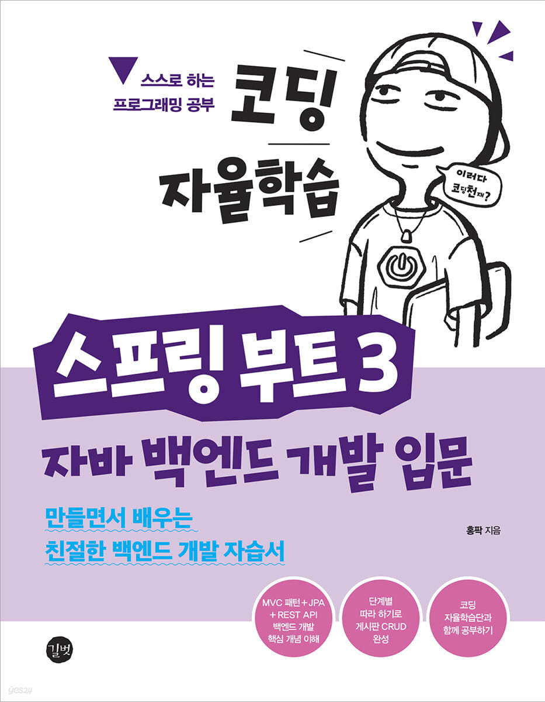

# 코딩 자율학습 스프링부트3

## 목차

### Part 1 스프링 부트 개요
1. 스프링 부트 시작하기
2. MVC 패턴 이해와 실습

### Part 2 게시판 CRUD 만들기
3. 게시판 만들고 새 글 작성하기: Create
4. 롬복과 리팩터링
5. 게시글 읽기: Read
6. 게시판 내 페이지 이동하기
7. 게시글 수정하기: Update
8. 게시글 삭제하기: Delete
9. CRUD와 SQL 쿼리 종합

### Part 3 REST API와 테스트 코드 작성하기
10. REST API와 JSON
11. HTTP와 REST 컨트롤러
12. 서비스 계층과 트랜잭션
13. 테스트 코드 작성하기

### Part 4 댓글 CRUD 만들기
14. 댓글 엔티티와 리파지터리 만들기
15. 댓글 컨트롤러와 서비스 만들기
16. 웹 페이지에서 댓글 목록 보기
17. 웹 페이지에서 댓글 등록하기
18. 웹 페이지에서 댓글 수정하기
19. 웹 페이지에서 댓글 삭제하기

### 원작자 및 출처
- **원작자:** 홍팍
- **출처:** 길벗
- **깃허브:** [080354 Repository](https://github.com/gilbutITbook/080354)
